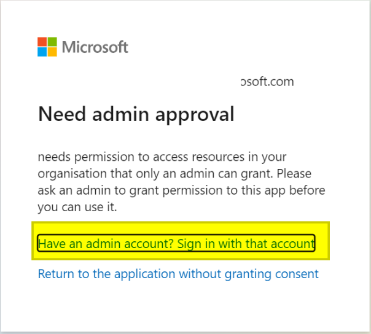

## How to use this module

Before using this module, you need to register your app in the Azure App Registrations portal.

1. Sign in to the Azure portal and search for the Microsoft Entra ID service.
2. On the left side menu, get into "App Registrations".
3. Select "New record".
4. Under “Compatible account types”, choose:
    - "Accounts in any organizational directory (any Azure AD directory: multi-tenant) and personal Microsoft accounts (such as Skype or Xbox)" for this case use Tenant ID = **common**.
    - "Only accounts from this organizational directory (only this account: single tenant) for this case use application-specific **Tenant ID**.
    - "Personal Microsoft accounts only" for this case use use Tenant ID = **consumers**.
5. Set the redirect uri (Web) as: https://login.microsoftonline.com/common/oauth2/nativeclient and click "Register".
6. Copy the application (client) ID. You will need this value.
7. Under "Certificates and secrets", generate a new client secret. Set the expiration (preferably 24 months). Copy the **VALUE** of the created client secret (**__NOT the Secret ID__**). It will hide after a few minutes.
8. Under "API permissions", click "Add a permission", select "Microsoft Graph", then "Delegated permissions", find and select "Mail.ReadWrite" and "User.Read", and finally " Add permissions".
9.  In Rocketbot Studio, insert the "Connect to O365" command, enter the requested data (client ID, secret value, and tenant), and run the command.
10. In the Rocketbot console a url will be generated, copy and paste it into your browser.
    - **Example:** https://login.microsoftonline.com/common/oauth2/v2.0/authorize?response_type=code&client_id=82f8efcd-6a0d-4532-a62e-3e2aecb4d19f&redirect_uri=https%3A%2F%2Flogin.microsoftonline.com%2Fcommon%2Foauth2%2Fnativeclient&scope=Mail.ReadWrite+User.Read.All&state=3LvNFBfX0qej9Q0rsixmSWjCGJyi0M&access_type=offline
11. Accept the permissions granting and it will return a screen without content. Copy the URL and Paste it into Rocketbot console below **"Paste the authenticated url here:"**.
    - **Example:** https://login.microsoftonline.com/common/oauth2/nativeclient?code=M.R3_SN1.5dcda10b-6567-ce05-3a5b-f67145c62684&state=3LvNFBfX0qej9Q0rsixmSWjCGJyi0M
12. Press "enter" and if the operation was successful you will see in the console: "Authentication Flow Completed. Oauth Access Token Stored. You can now use the API." and a file will have been created with your credentials, in the root folder of Rocketbot, called o365_token.txt or o365_token_{session}.txt.

## ERROR

If in the login tab that opens when you execute the connection command you see this error:

It is because the necessary administrator permissions have not been granted to the user, so the Administrator must perform the following steps:

1. Go to Azure portal >
2. Go to Azure Active Directory
3. Select your application
4. Go to API Permissions
5. Grant administrator consent

Alternatively, you can also allow users to consent to the app without administrator approval as follows:

1. Go to Azure portal
2.Enterprise Application
3. User settings
4. Go to Consent and permissions
5. Allow users to consent to apps
---

## Como usar este modulo

Antes de usar este módulo, es necesario registrar tu aplicación en el portal de Azure App Registrations. 

1. Inicie sesión en Azure Portal y busque el servicio Microsoft Entra ID.
2. En el menu en el lateral izquierdo, ingrese a "Registros de Aplicaciones".
3. Seleccione "Nuevo registro".
4. En “Tipos de cuenta compatibles”, elija:
    - "Cuentas en cualquier directorio organizativo (cualquier directorio de Azure AD: multiinquilino) y cuentas de Microsoft personales (como Skype o Xbox)" para este caso utilizar  ID Inquilino = **common**.
    - "Solo cuentas de este directorio organizativo (solo esta cuenta: inquilino único) para este caso utilizar **ID Inquilino** especifico de la aplicación.
    - "Solo cuentas personales de Microsoft " for this case use use Tenant ID = **consumers**.
5. Establezca la uri de redirección (Web) como: https://login.microsoftonline.com/common/oauth2/nativeclient y haga click en "Registrar".
6. Copie el ID de la aplicación (cliente). Necesitará este valor.
7. Dentro de "Certificados y secretos", genere un nuevo secreto de cliente. Establezca la caducidad (preferiblemente 24 meses). Copie el **VALOR** del secreto de cliente creado (**__NO el ID de Secreto__**). El mismo se ocultará al cabo de unos minutos.
8. Dentro de "Permisos de API", haga click en "Agregar un permiso", seleccione "Microsoft Graph", luego "Permisos delegados", busque y seleccione "Mail.ReadWrite" y "User.Read", y por ultimo "Agregar permisos".
9. En Rocketbot Studio, insertar el comando "Conectar a O365", ingresar los datos solicitados (ID de cliente, valor del secreto y tenant) y ejecutar el comando.
10. En la consola de Rocketbot se generara una url, copiarla y pegarla en su navegador.
    - **Ejemplo:** https://login.microsoftonline.com/common/oauth2/v2.0/authorize?response_type=code&client_id=82f8efcd-6a0d-4532-a62e-3e2aecb4d19f&redirect_uri=https%3A%2F%2Flogin.microsoftonline.com%2Fcommon%2Foauth2%2Fnativeclient&scope=Mail.ReadWrite+User.Read.All&state=3LvNFBfX0qej9Q0rsixmSWjCGJyi0M&access_type=offline
11. Aceptar el otorgamiento de permisos y devolverá una pantalla sin contenido. Copiar la URL y pegarla el la consola de Rocketbot debajo de **"Paste the authenticated url here:"**.
    - **Ejemplo:** https://login.microsoftonline.com/common/oauth2/nativeclient?code=M.R3_SN1.5dcda10b-6567-ce05-3a5b-f67145c62684&state=3LvNFBfX0qej9Q0rsixmSWjCGJyi0M 
12. Presionar "enter" y si la operación fue exitosa vera en la consola: "Authentication Flow Completed. Oauth Access Token Stored. You can now use the API." y se habra creado un archivo con sus credenciales, en la carpeta raíz de Rocketbot, llamado o365_token.txt o o365_token_{session}.txt.

## Como filtrar correos

Para realizar filtro de correos deberá utilizar los siguientes Operadores y Funciones. 

1. __Equality operators__	
    - Igual (__eq__)
    - Diferente (__ne__)
    - Negación (__not__)
    - En (__in__)
    - Tiene (__has__)
2. __Relational operators__
    - Menor que (__lt__)
    - Mayor que (__gt__)
    - Menor o igual que (__le__)
    - Mayor o igual que (__ge__)
3. __Conditional operators__
    - Y (__and__)
    - O (__or__)
4. __Functions__	
    - Comienza con (__startsWith__)
    - Termina con (__endsWith__)
    - Contiene (__contains__)

Las principales propiedades que pueden utilizarse para realizar filtros son:

    "createdDateTime": "2022-10-24T13:14:24Z",
    "categories": [],
    "receivedDateTime": "2022-10-24T13:14:24Z",
    "sentDateTime": "2022-10-24T13:14:09Z",
    "hasAttachments": true/false,
    "importance": "",
    "isReadReceiptRequested": true/false,
    "isRead": true/false,
    "isDraft": true/false,
    "inferenceClassification": "",
    "body": {
        "contentType": "",
        "content": ""
    },
    "sender": {
        "emailAddress": {
            "name": "",
            "address": ""
        }
    },
    "from": {
        "emailAddress": {
            "name": "",
            "address": ""
        }
    },
    "toRecipients": [
        {
            "emailAddress": {
                "name": "",
                "address": ""
            }
        }
    ],
    "ccRecipients": [
        {
            "emailAddress": {
                "name": "",
                "address": ""
            }
        }
    ],
    "bccRecipients": [
        {
            "emailAddress": {
                "name": "",
                "address": ""
            }
        }
    ],
    "replyTo": [
        {
            "emailAddress": {
                "name": "",
                "address": ""
            }
        }
    ],
    "flag": {
        "flagStatus": ""
    }

Las mismas surgen del json de la respuesta a la consulta realizada a la API. Para revisar las propiedades de correos específicos puede ingresar a https://developer.microsoft.com/en-us/graph/graph-explorer ingresando con su cuenta de AZURE y realizar la consulta https://graph.microsoft.com/v1.0/me/messages/<ID_correo>.

Es importante tener presente que solo deben utilizarse comillas simples (') cuando se indique el valor a filtrar, salvo para el caso de valores booleanos (__true__ / __false__). A continuación se muestran ejemplos prácticos de cómo realizar filtros:

- Correos no leidos = __isRead eq false__
- Correos leidos = __isRead eq true__
- El Asunto es igual a... = __subject eq ‘example’__
- El Asunto contiene... = __contains(Subject, ‘example’)__
- El Asunto comienza con la palabra... = __startswith(Subject, ‘example’)__
- La fecha de recepción esta entre... = __ReceivedDateTime ge <date> and ReceivedDateTime le <date>__
- El cuerpo del correo contiene... = __contains(Body/Content, ‘example’)__
- El remitente del correo es igual a... = __From/EmailAddress/Address eq ‘example@example.com’__
- El remitente del correo comienza con... = __Startswith(From/EmailAddress/Address, ‘example’)__
- El correo tiene adjuntos = __HasAttachments eq true__
## Como identificar correos (ID)

Los correos se encuentran identificados con un ID único y dinámico. Esta última cualidad hace que si un correo cambia algunas de sus propiedades el ID se verá afectado, el caso más claro se produce al cambiar un correo de carpeta. Por ejemplo: el ID de un correo en Inbox no será el mismo una vez lo hayamos movido a la carpeta "Procesados", para volver a hacer uso del correo se deberá ejecutar el comando Listar Emails sobre la carpeta "Procesados" y obtener el nuevo ID.

Cuando utilice 'filtro' y 'ordenar por' en la misma consulta para obtener mensajes, asegúrese de especificar las propiedades de las siguientes maneras:

Las propiedades que aparecen en 'ordenar por' también deben aparecer en 'filtro'.
Las propiedades que aparecen en 'ordenar por' están en el mismo orden que en 'filtro'.
Las propiedades que están presentes en 'ordenar por' aparecen en 'filtro' antes de cualquier propiedad que no lo esté.

## ERROR

Si en la pestaña de login que se abre al ejecutar el comando de conexión visualizas este error:

Es porque no se han concedido los permisos de administrador necesarios al usuario, por lo que el Administrador deberá realizar los siguientes pasos:

1. Ir a Azure Portal > 
2. Ir a Azure Active Directory 
3. Selecciona tu aplicación 
4. Ir a API Permissions
5. Conceder consentimiento del administrador

Alternativamente, también puede permitir que los usuarios den su consentimiento a la aplicación sin la aprobación del administrador de la siguiente manera:

1. Ir a Azure Portal 
2. Enterprise Application 
3. Ajustes de usuario 
4. Ir a Consentimiento y permisos
5. Permitir a los usuarios consentir para aplicaciones

---

## Como usar este módulo

Antes de usar este módulo, você precisa registrar seu aplicativo no portal de Registros de Aplicativo do Azure.

1. Entre no portal do Azure e procure o serviço Microsoft Entra ID.
2. No menu do lado esquerdo, entre em "Registros de aplicativos".
3. Selecione "Novo registro".
4. Em "Tipos de conta compatíveis", escolha:
    - "Contas em qualquer diretório organizacional (qualquer diretório do Azure AD: multilocatário) e contas pessoais da Microsoft (como Skype ou Xbox)" para este caso, use ID de locatário = **common**.
    - "Somente contas deste diretório organizacional (somente esta conta: locatário único) para este caso usam **ID de locatário específico** do aplicativo.
    - "Somente contas pessoais da Microsoft" para este caso, use ID do locatário = **consumers**.
5. Defina o uri de redirecionamento (Web) como: https://login.microsoftonline.com/common/oauth2/nativeclient e clique em "Registrar".
6. Copie o ID do aplicativo (cliente). Você vai precisar desse valor.
7. Em "Certificados e segredos", gere um novo segredo do cliente. Defina a validade (de preferência 24 meses). Copie o **VALUE** do segredo do cliente criado (**__NÃO o ID do segredo__**). Ele vai esconder depois de alguns minutos.
8. Em "Permissões de API", clique em "Adicionar uma permissão", selecione "Microsoft Graph", depois em "Permissões delegadas", localize e selecione "Mail.ReadWrite" e "User.Read" e, finalmente, "Adicionar permissões".
9. No Rocketbot Studio, insira o comando "Connect to O365", insira os dados solicitados (ID do cliente, valor secreto e locatário) e execute o comando.
10. No console do Rocketbot será gerado um URL, copie e cole no seu navegador.
    - **Exemplo:** https://login.microsoftonline.com/common/oauth2/v2.0/authorize?response_type=code&client_id=82f8efcd-6a0d-4532-a62e-3e2aecb4d19f&redirect_uri=https%3A%2F%2Flogin.microsoftonline.com%2Fcommon%2Foauth2%2Fnativeclient&scope=Mail.ReadWrite+User.Read.All&state=3LvNFBfX0qej9Q0rsixmSWjCGJyi0M&access_type=offline
11. Aceite a concessão de permissões e retornará uma tela sem conteúdo. Copie o URL e cole-o no console do Rocketbot abaixo de **"Paste the authenticated url here:"**.
    - Exemplo: https://login.microsoftonline.com/common/oauth2/nativeclient?code=M.R3_SN1.5dcda10b-6567-ce05-3a5b-f67145c62684&state=3LvNFBfX0qej9Q0rsixmSWjCGJyi0M
12. Pressione "enter" e se a operação foi bem sucedida você verá no console: "Authentication Flow Completed. Oauth Access Token Stored. You can now use the API." e será criado um arquivo com suas credenciais, na pasta raiz do Rocketbot, chamado o365_token.txt o o365_token_{session}.txt.

## ERRO

Se na guia de login que abre quando você executa o comando de conexão você vê este erro:

Isso ocorre porque as permissões de administrador necessárias não foram concedidas ao usuário, portanto o Administrador deve executar as seguintes etapas:

1. Acesse o portal do Azure >
2. Vá para Azure Active Directory
3. Selecione seu aplicativo
4. Vá para Permissões da API
5. Conceda consentimento do administrador

Como alternativa, você também pode permitir que os usuários concordem com o aplicativo sem a aprovação do administrador, da seguinte forma:

1. Acesse o portal do Azure
2. Aplicação Empresarial
3. Configurações do usuário
4. Vá para Consentimento e permissões
5. Permitir que os usuários concordem com os aplicativos
