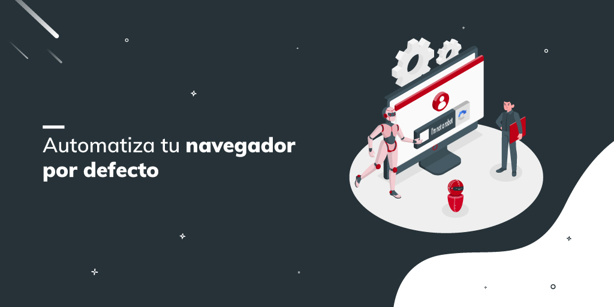

# browser_automation
  
This module opens the browser without the alert that it is automated. Useful for working with extensions, captcha and desktopRecorder  

*Read this in other languages: [English](Manual_browser_automation.md), [Português](Manual_browser_automation.pr.md), [Español](Manual_browser_automation.es.md)*
  

## How to install this module
  
To install the module in Rocketbot Studio, it can be done in two ways:
1. Manual: __Download__ the .zip file and unzip it in the modules folder. The folder name must be the same as the module and inside it must have the following files and folders: \__init__.py, package.json, docs, example and libs. If you have the application open, refresh your browser to be able to use the new module.
2. Automatic: When entering Rocketbot Studio on the right margin you will find the **Addons** section, select **Install Mods**, search for the desired module and press install.  

## Description of the commands

### Open Browser
  
Open a selected browser
|Parameters|Description|example|
| --- | --- | --- |
|Browser|Browser you want to use.|Chrome|
|URL|URL to access.|https://rocketbot.com/en|
|Profile folder (Optional)|Profile folder (leave empty to use default rocketbot folder for testing).|C:/Users/User/Desktop/browser_profile|
|Port (Optional)|Port in which the automated browser will open. (Optional)|5002|
|Search free port (Optional)|Search for a free port to open the automated browser. (Optional)|False|
|Activate accessibility features|Activates the browser's accessibility features.|False|

### Close Browser
  
Close a selected browser
|Parameters|Description|example|
| --- | --- | --- |
| --- | --- | --- |